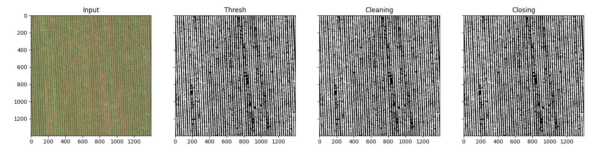
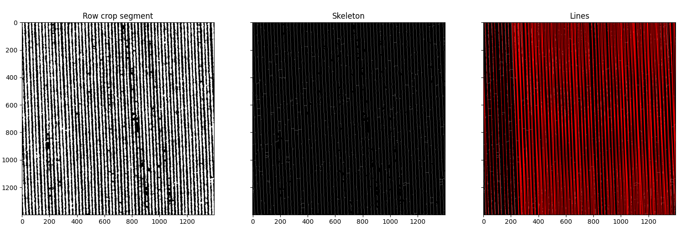
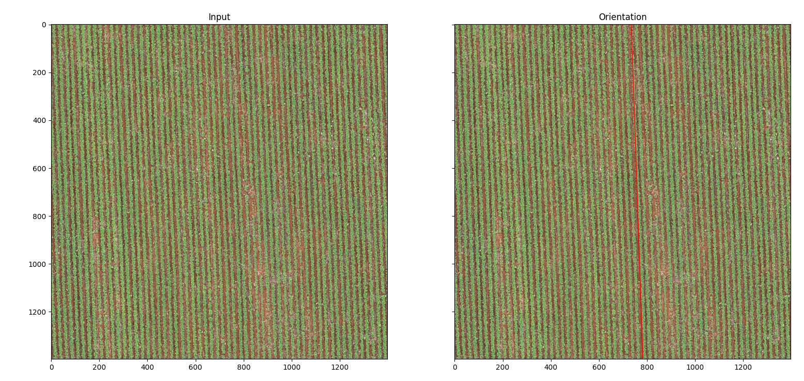
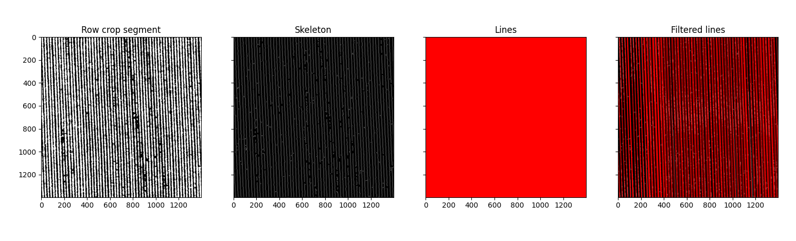
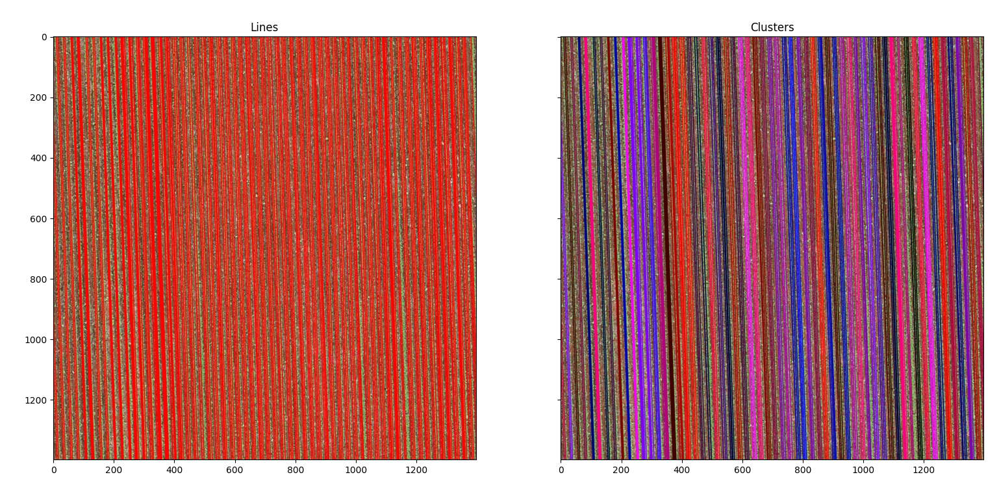
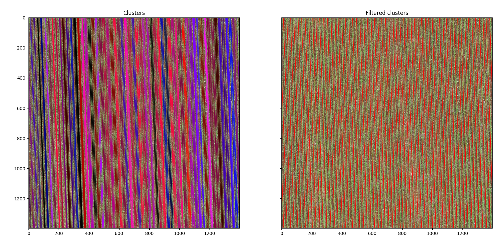
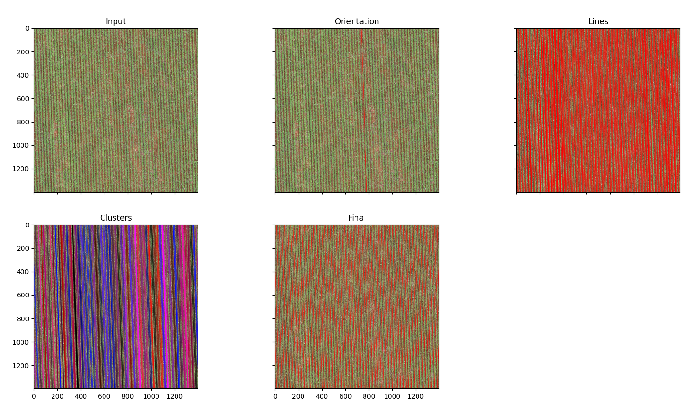

# moray-test

Teste de Visão Computacional da empresa Moray.

## Problema proposto

Detecção de linhas de plantação em imagens de drone capturadas perpendicularmente ao solo. Exemplo:

<p align="center">
  
</p>

## Solução proposta

Fluxograma da solução proposta para segmentação das linhas de plantação:


### Pré-processamento

Etapa que consiste em aplicar melhorias na imagem, para destacar mais a região de interesse (linhas de plantação). Foram testadas diversas metodologias, desde mudança do espaço de cores (HSV, CMKY, etc) a equalização de histograma. No entanto, devido à diversidade encontrada nas imagens, essas abordagens não foram selecionadas. Foi então desenvido um pré-processamento customizado a fim de destacar as faixas de plantação.
Observando as imagens, as faixas de plantação tem a peculiaridade de que o canal verde (G) tende a se destacar um pouco em relação aos demais (R e B), o que dá a natureza "verde" ao objeto, independente da tonalidade. Nesse sentido, foi feita uma limiarização com a seguinte regra:

```text
Se G > B e G > R
    color = 255
Senão
    color = 0
```

Após isso, contornos com área menor que 25 foram removidos. Um exemplo pode ser visto abaixo:

<p align="center">
  
</p>

### Inferir orientação geral

Após obtenção da máscara inicial das faixas de plantação, é extraído o *esqueleto* dos contornos, isto é, linhas de 1 pixel de largura. Em seguida, são detectadas linhas com a Transformada de Hough:

<p align="center">
  
</p>

Por fim, espera-se que a grande maioria das linhas estejam na orientação das linhas de plantação. Para tal, é extraído a mediana das retas:

<p align="center">
  
</p>

### Extrair linhas na direção orientada

Uma vez que já se tem a orientação das linhas de plantação, fica mais cômodo testar técnicas mais ousadas. Uma ideia interessante seria em analisar o gradiente na direção perpendicular à linha de orientação, uma vez que isso destacaria bem as transições de cada faixa de plantação. No entanto, essa solução propõe uma abordagem mais simples.

Sob a imagem resultante do preprocessamento *antes de remover os contornos menores*, é extraído o elemento estruturante (*skeleton*). Em seguida é feita uma dilatação com kernel 5 x 5, e então é aplicado o detector de bordas Canny. Nessa imagem resultante é extraído a Transformada de Hough e, por fim, é feita uma filtragem simples das linhas obtidas em relação ao ângulo de orientação do passo anterior. Toda as retas com desvio acima de 0.5° em relação à orientação são eliminadas. Veja:

<p align="center">
  
</p>

### Agrupar linhas

Após a extração das linhas na orientação da plantação, as linhas mais próximas entre si são agrupadas em *clusters*, ou seja, grupos de linha correspondentes a uma mesma faixa de plantação. Cada grupo tem uma distância mínima isolado de outras linhas para ser considerado um grupo. Após esse processo, os grupos de linhas são identificados. Veja:

<p align="center">
  
</p>

### Filtragem dos agrupamentos (clusters)

Com cada *cluster* definido, deve-se obter a linha que melhor define a faixa de plantação. Para tal, é extraído a mediana das linhas de um mesmo *cluster* para que ela represente aquela faixa de plantação. Fazendo isso para todos os *clusters*, tem-se o resultado final da detecção:

<p align="center">
  
</p>

## Resultados

- Tempo de processamento: ...
  - Pré-processamento: ...
  - Inferir orientação: ...
  - Extrair linhas orientadas: ...
  - Agrupar linhas: ...
  - Filtrar agrupamentos: ...

- Memória (RAM): ...

- Fluxo completo:
<p align="center">
  
</p>
